# Procesverslag
Markdown is een simpele manier om HTML te schrijven.  
Markdown cheat cheet: [Hulp bij het schrijven van Markdown](https://github.com/adam-p/markdown-here/wiki/Markdown-Cheatsheet).

Nb. De standaardstructuur en de spartaanse opmaak van de README.md zijn helemaal prima. Het gaat om de inhoud van je procesverslag. Besteedt de tijd voor pracht en praal aan je website.

Nb. Door *open* toe te voegen aan een *details* element kun je deze standaard open zetten. Fijn om dat steeds voor de relevante stuk(ken) te doen.

## Jij

  
uitwerken voor kick-off werkgroep

  ### Auteur:
 Quincy Sung

  #### Je startniveau:
  Blauw / Rood

  #### Je focus:
  Responsive, met een beetje surface plane
 

## Je website

  
uitwerken voor kick-off werkgroep

  ### Je opdracht:
https://playvalorant.com/en-gb/

  #### Screenshot(s) van de eerste pagina (small screen): 
  hier de naam van de pagina  
  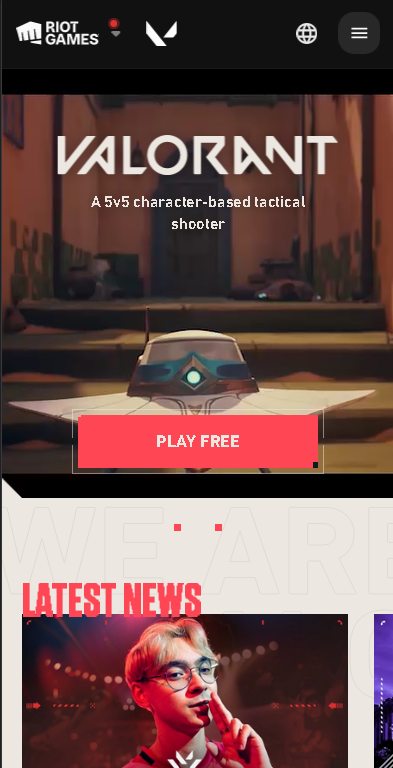

  #### Screenshot(s) van de tweede pagina (small screen):
  hier de naam van de pagina  
  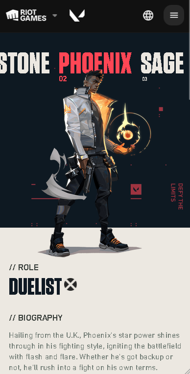
 

## Toegankelijkheidstest 1/2 (week 1)

  
uitwerken na test in 2e werkgroep

  ### Bevindingen
     Verschillende soorten slechtziendheid:
        Slechtziende mensen zien niet allemaal hetzelfde. Sommigen zien puntjes, vlekken, wazigheid, of onscherp.

    Niet alle blinden zien hetzelfde:
        Mensen die als blind worden beschouwd, ervaren verschillende niveaus van visuele beperking. Sommigen zien licht en schaduw of zelfs vlekken, anderen zien helemaal niets.

    Problemen met bewegen voor mensen met spiertrekkingen:
        Mensen met spiertrekkingen vinden het moeilijk om een muis normaal te bewegen en toetsen normaal in te drukken.

    Leesproblemen:
        Mensen met spiertrekkingen kunnen moeite hebben met rustig lezen vanwege onvoorspelbare spierbewegingen. Dit zorgt voor langzamer lezen en begrijpen.

    Aanpassingen in bediening:
        Het is belangrijk om eenvoudige bedieningsopties te kiezen voor mensen met spiertrekkingen, zoals spraakopdrachten.

## Breakdownschets (week 1)

  
uitwerken na afloop 3e werkgroep

  ### de hele pagina: 
  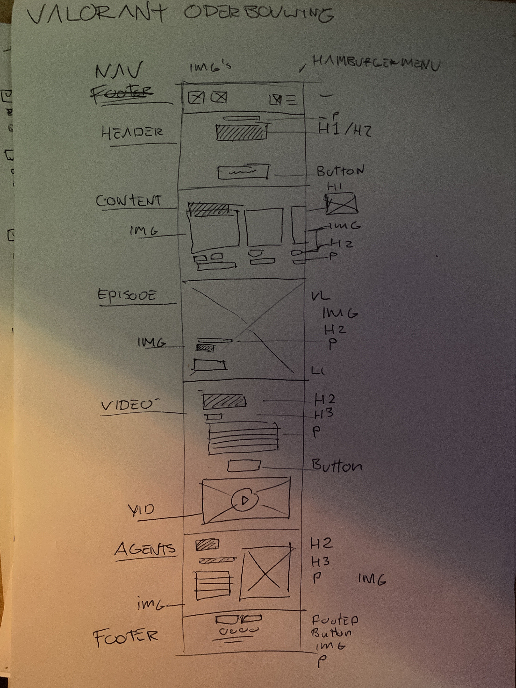

breakdown van de hele pagina - de structuur, welke elementen gebruikt worden.

  ### dynamisch deel (bijv menu): 
  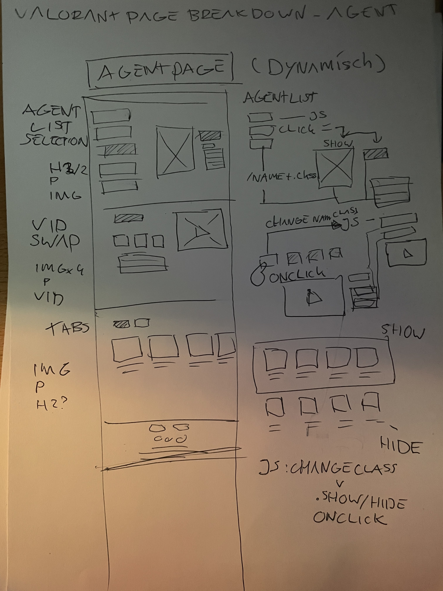

  breakdown van een dynamisch deel - agen pagina, met selectie van agent, video swap en de tab switch

  ### wellicht nog een dynamisch deel (bijv filter): 
  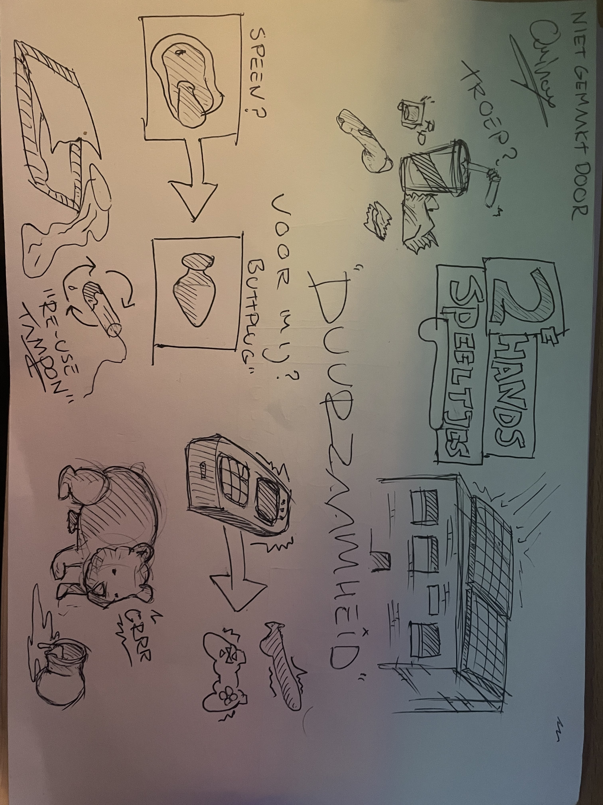

  niet nodig dit was al moeilijk genoeg - tijdens het coderen had ik mentale achterstanden opgelopen, dit plaatje heeft mij een beetje op kunnen lichten

## Voortgang 1 (week 2)

  
uitwerken voor 1e voortgang

  ### Stand van zaken
  hier dit ging goed & dit was lastig (neem ook screenshots op van delen van je website en code)
  
  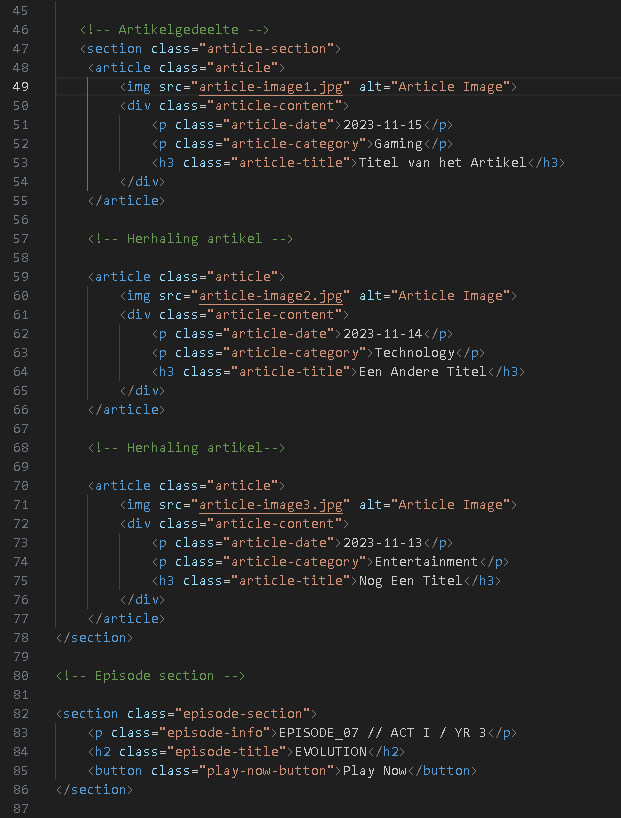

  Hier  ben ik begonnen met het opbouwen van de html, dit is een voorbeeld bvan mn article gedeelte

  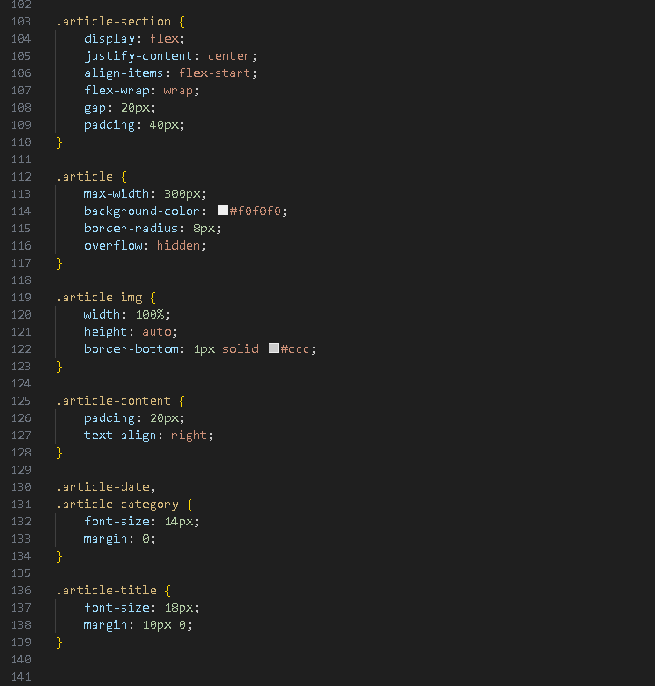

  en ook een beetje css alvast, dit heb ik voor alles gedaan van de main pagina

  

  ### Agenda voor meeting
  samen met je groepje opstellen

  | student 1      | student 2          | student 3    | student 4        |
  | ---            | ---                | ---          | ---              |
  | dit bespreken  | en dit             | en ik dit    | en dan ik dat    |
  | en dat ook nog | dit als er tijd is | nog een punt | dit wil ik zeker |
  | ...            | ...                | ...          | ...              |

  ### Verslag van meeting
  hier na afloop snel de uitkomsten van de meeting vastleggen

  - punt 1
  - punt 2
  - nog een punt
  - ...

## Voortgang 2 (week 3)

  
uitwerken voor 2e voortgang

  ### Stand van zaken
  hier dit ging goed & dit was lastig (neem ook screenshots op van delen van je website en code)

   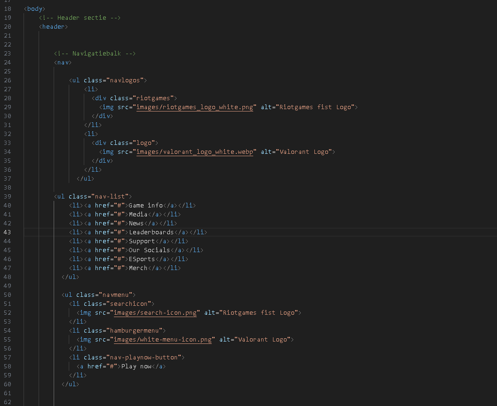

   Hier ben ik met de navigatie balk aan de slag gegaan, eerst met een standaard structuur, zonder javascript

  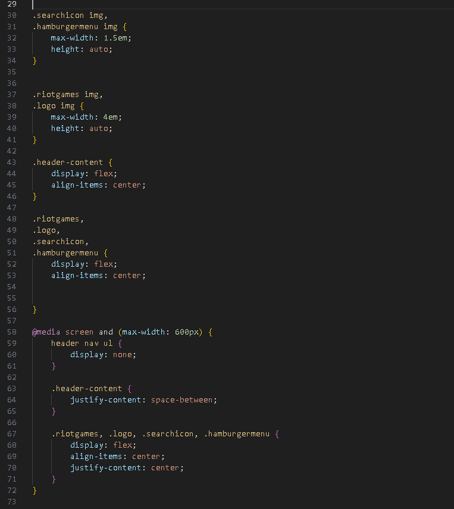

  Ook een beetje stijling, en ge-experimenteerd met @media Querry's

  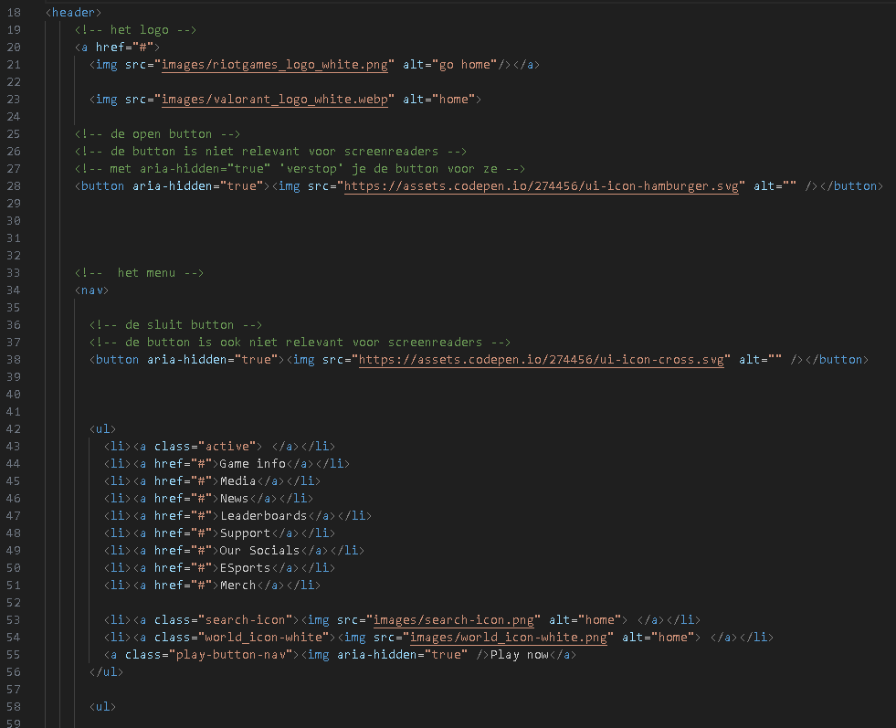
  

  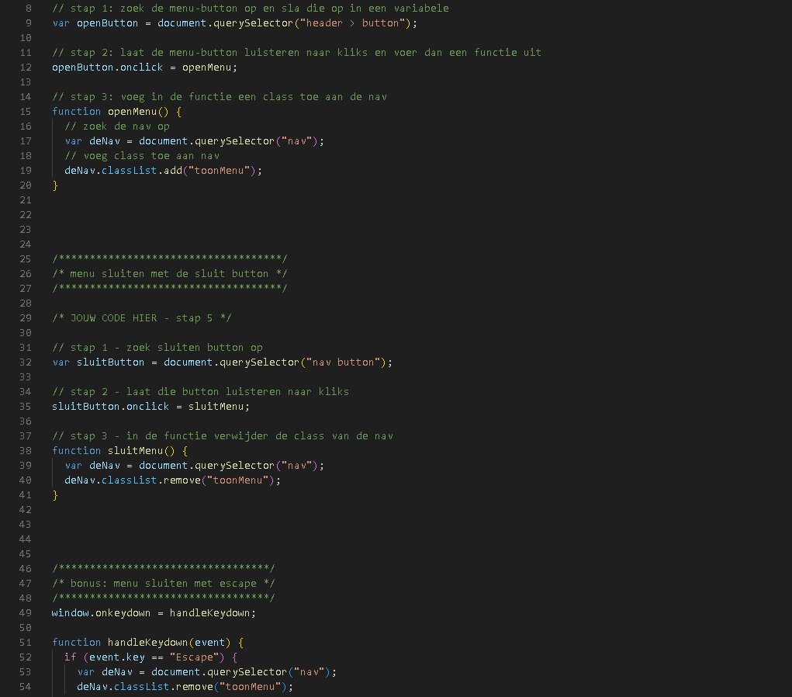

  Ik heb nu uit de huiswerk opdracht de navigatie balk over genomen en ik ga het aanpassen zodat het lkloppend is met de valorant navigatie, het belangrijke hier zijn de buttons, om de navigatie in te klappen en uit.

  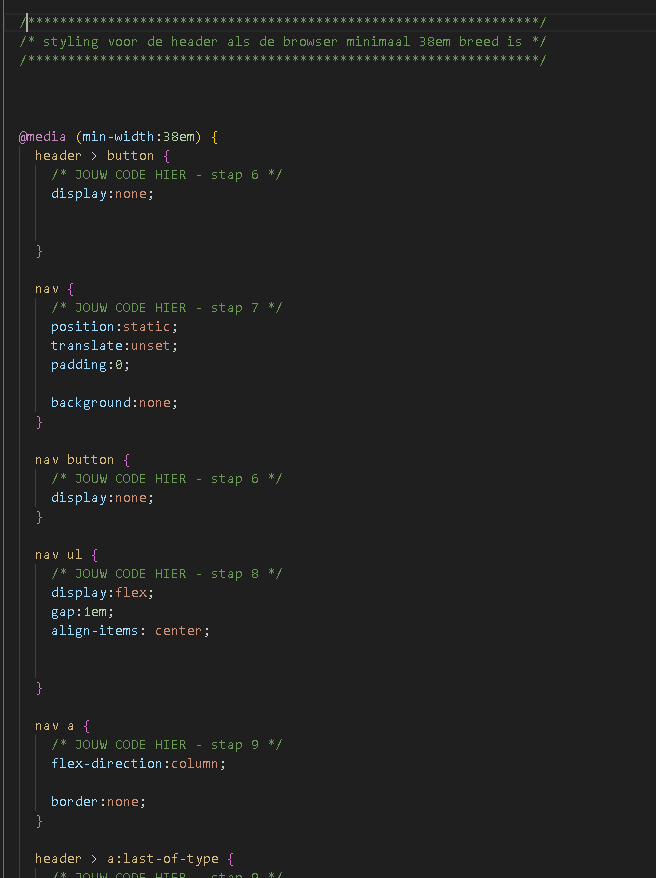

  Dit is de javascript die ik over heb genomen, hier heb ik verder niets aangepast

  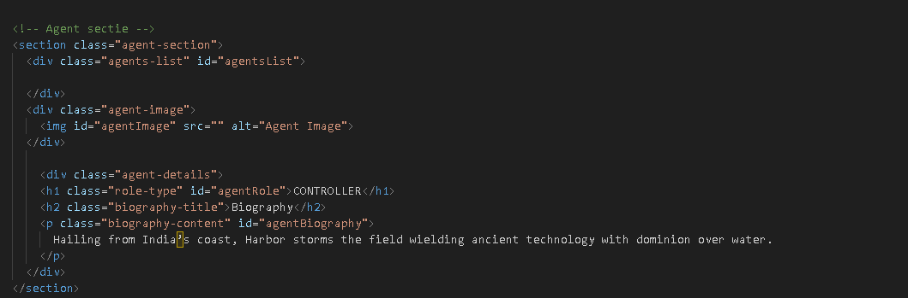

  En ook de styling heb ik volledig aangepast zodat alles kloppend is, ik heb hier weer gebruik gemaakt van @media Querry's, ook heb ik het menu zelf gestijld , hier kwam ik later pas achter, en dit koste mij rete veel tijd. want ik paste steeds iets aan op mobile en dan klopte het weer niet op desktop, en visa versa. hoofdpijn, uiteindelijk ben ik overnieuw begonnen en heb ik de menu en de nav balk los stijl gegeven. en flexboxes etc

  ### Agenda voor meeting
  samen met je groepje opstellen

  | student 1      | student 2          | student 3    | student 4        |
  | ---            | ---                | ---          | ---              |
  | dit bespreken  | en dit             | en ik dit    | en dan ik dat    |
  | en dat ook nog | dit als er tijd is | nog een punt | dit wil ik zeker |
  | ...            | ...                | ...          | ...              |

  ### Verslag van meeting
  hier na afloop snel de uitkomsten van de meeting vastleggen

  - punt 1
  - punt 2
  - nog een punt
- ...

## Toegankelijkheidstest 2/2 (week 4)

  
uitwerken na test in 9e werkgroep

  ### Bevindingen
  Lijst met je bevindingen die in de test naar voren kwamen (geef ook aan wat er verbeterd is):

## Voortgang 3 (week 4)

  
uitwerken voor 3e voortgang

  ### Stand van zaken
  hier dit ging goed & dit was lastig (neem ook screenshots op van delen van je website en code)

   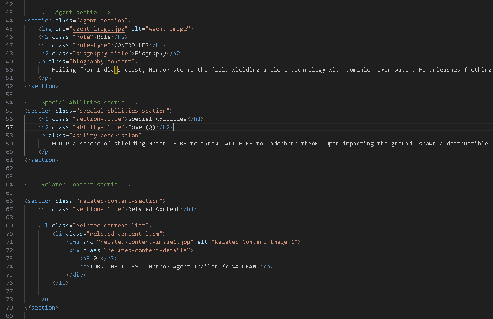

   Hier ben ik begonnen aan de 2e pagina, de agents pagina. ik ben hier begonnen met een standaard html structuur die ik later met javacript wil aanpassen.

   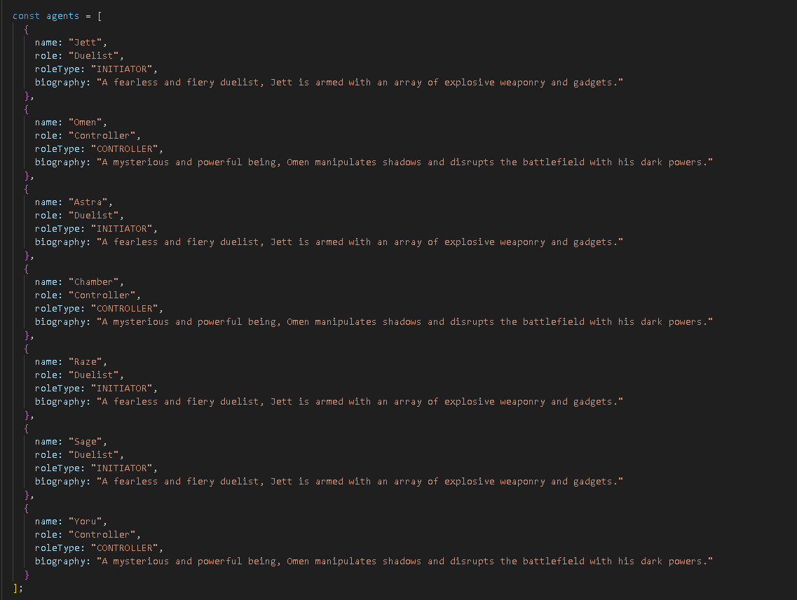

   Ik heb hier de html aangepast, id's en speciale classes gegeven zodat ik die kan defineren in js
   
   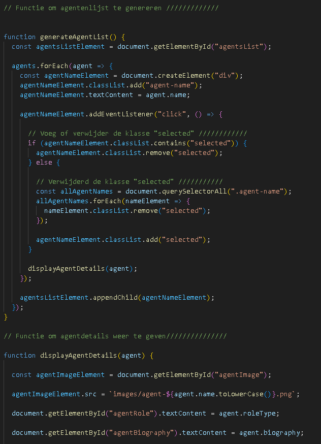

   Ik heb alle inhoud van naam tot biografie, in de javascript document gezet hier tussen moet het systeem straks wisselen.

   

    en dit is hoe de agent list functie werkt, afhankelijk van welke naam je klikt, word daarop de info geladen die bij die naam behoort. en vervangen in het html bestand.( vanuit java)

  ### Agenda voor meeting
  samen met je groepje opstellen

  | student 1      | student 2          | student 3    | student 4        |
  | ---            | ---                | ---          | ---              |
  | dit bespreken  | en dit             | en ik dit    | en dan ik dat    |
  | en dat ook nog | dit als er tijd is | nog een punt | dit wil ik zeker |
  | ...            | ...                | ...          | ...              |

  ### Verslag van meeting
  hier na afloop snel de uitkomsten van de meeting vastleggen

  - punt 1
  - punt 2
  - nog een punt
  - ...

## Eindgesprek (week 5)

  
uitwerken voor eindgesprek

  ### Je uitkomst - karakteristiek screenshots:
  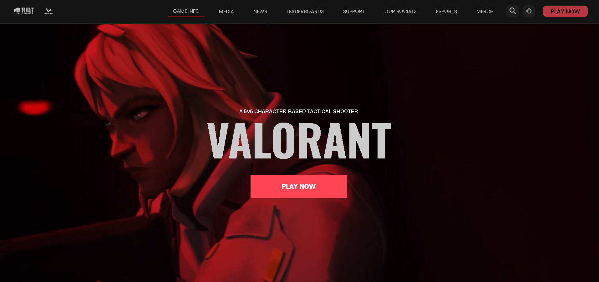

  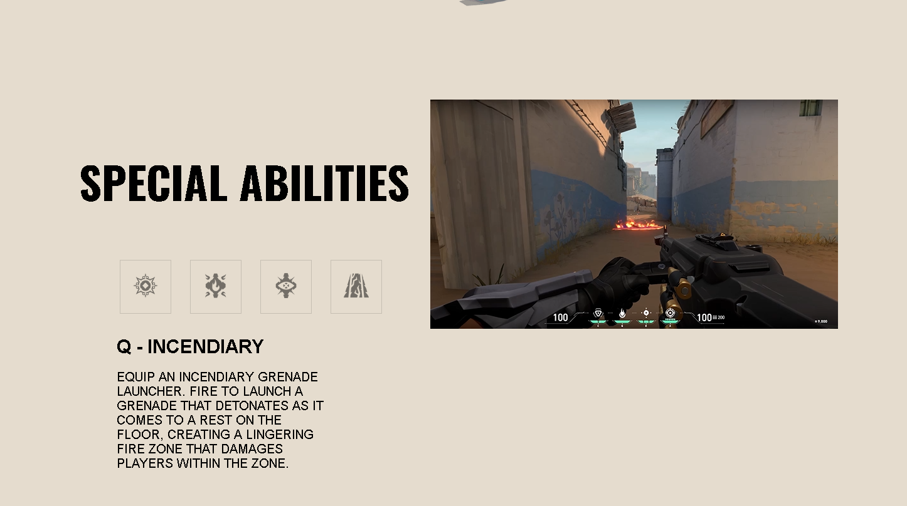

  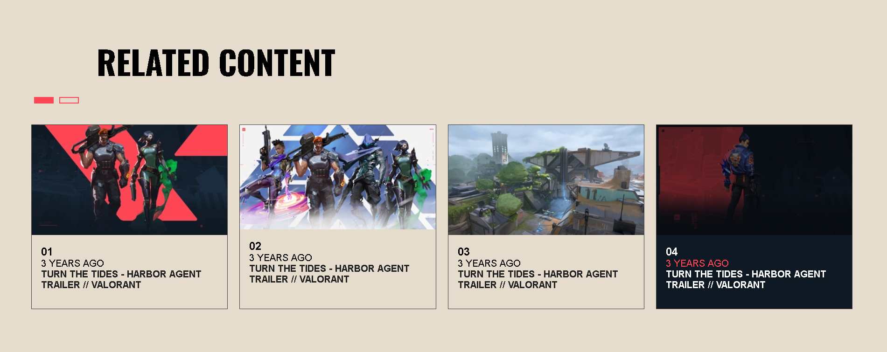

  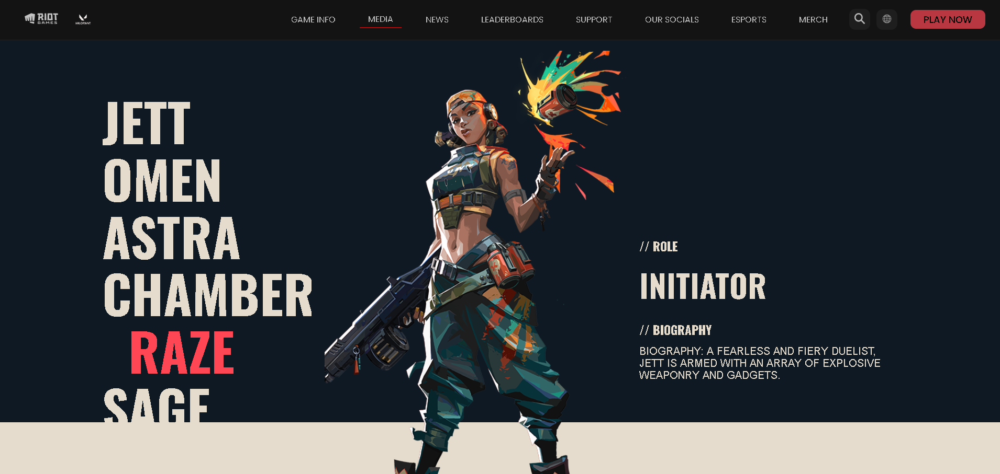

  ### Dit ging goed/Heb ik geleerd: 
  Korte omschrijving met plaatjes

  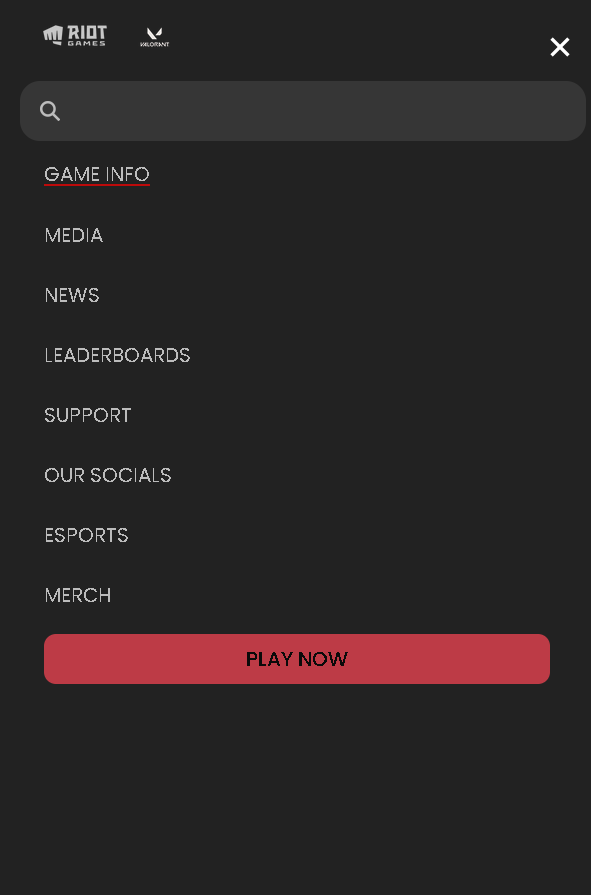

  Ik heb veel geleerd van dit vak, het werken met @media qeurry,s het oppakken van javascript, en het worstelen met de navigatie balk en het uitklapmenuutje was heel irritant, maar ik ben blij dat het uiteindelijk gelukt is.

  ### Dit was lastig/Is niet gelukt:
 het was ook lastig om met sommige afbeeldingen en achtergronden te werken, ze bleven continu elkaar verschuiven, en het zat nooit goed op beide schermen, het was erg lastig en heb het nog steeds niet helemaal werkend gekregen
 
de orginele site gebruikt veel smooth animataties met javascript die mij niet gelukt zijn jammer genoeg. zoals scroll paralax effecten.

Bij de agent selection list, hebben ze een hele soepele carousel gemaakt, waar je tussen namen kan scrollen door te slepen, dat is mij bij verre na niet gelukt.

  

## Bronnenlijst

  
continu bijhouden terwijl je werkt

  Nb. Wees specifiek ('css-tricks' als bron is bijv. niet specifiek genoeg). 
  Nb. ChatGpT en andere AI horen er ook bij.
  Nb. Vermeld de bronnen ook in je code.

  1. https://css-tricks.com/tabs-its-complicated/
  2. https://www.w3schools.com/howto/howto_js_topnav_responsive.asp
  3. https://css-tricks.com/css-only-carousel/
  4. https://www.w3schools.com/howto/howto_js_tab_header.asp
  5. https://www.w3schools.com/tags/att_video_autoplay.asp

  AI 
    1. https://chat.openai.com

